# Creating a Sample Application with the Low-Code Approach

## Introduction

This tutorial uses a sample sales application to explain how you develop applications with the low-code approach in DevMagic Studio. Please get the sample sales application at this repository.

The application has a basic setup of two companies, two users, and four products.  When the application is run, it allows you to perform the following operations:

(You can jump to the [Generate projects](#generate-projects) and [Run projects](#run-projects) sections and have a quick look at the application pages first.)

- Add customers (with fields: Name, Telephone)
- Add new company (with fields: CompanyName, ContactNumber)
- Add new products (with fields: Product Name, Manufacturer, Product Specification, Product Batch, Product Price, Product Date, Shelf Life, ShelfLifeUnit)
- Create and manage order.  Each order contains the following information: 
  - Purchaser
  - PaymentType
  - Order items (including product and quantity)
- Create statistics report (Note: due to a known issue in the current version, you need to manually adjust the service for successfully generating the report). 

The application logics cover expressions, computed columns, data correlation, query condition, and business models. 

## Recommended process for the low-code development

The following are our recommended process for the low-code development of the application.

### Create a low-code project

In DevMagic Studio, select **File** > **New** > **New project** > **Low-Code Project**. If you have downloaded our sample application, you may open it directly in DevMagic Studio Preview.

### Design low-code items

#### Design the enumeration types

Right-click the **Sample.Design** project and create two new "Enum design" items. In the sample application, you may open **PaymentType.dme** and **ShelfLifeUnit.dme** and see how they are designed.

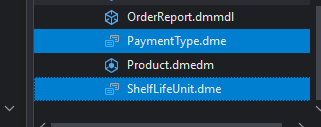

The **PaymentType.dme** file defines four payment types as shown below.

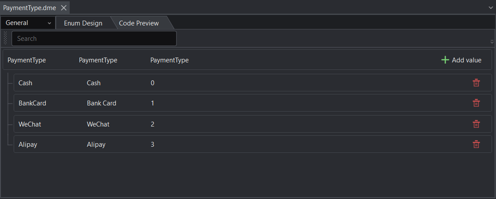

The **ShelfLifeUnit.dme** file defines the unit of the shelf life as shown below. 

#### Design the EntityBase entity

Right-click the **Sample.Design** project and create a new "Entity design" item. In the sample application, you may open the **EntityBase.dmedm** and see how it is designed.

The **EntityBase** entity is the base class for all other entities in this application. It contains the fields that are commonly used by the other entities.

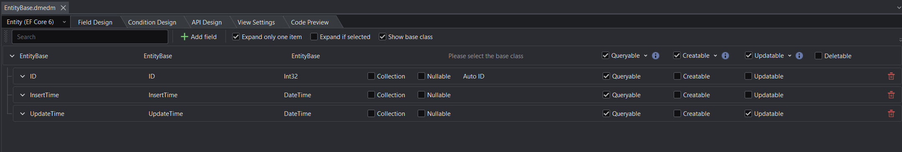

The following outlines the key steps to design the **EntityBase** entity:

1. Set the **ID** field as the primary key.

   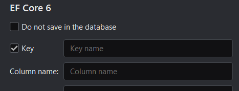

2. Set the default values for both **InsertTime** and **UpdateTime** to the current time using the `Now()` expression:

   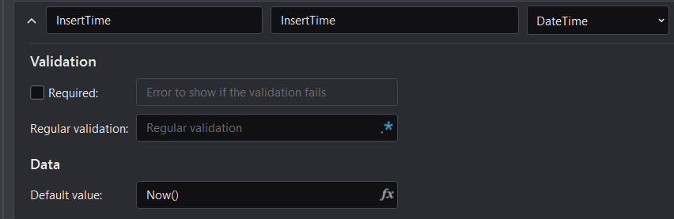

3. Set all these three fields to be querable, so that they can be displayed for view in the application.

4. Set the **UpdateTime** field to be updatable.

#### Design the **Product** and **Manufacturer** entities

Right-click the **Sample.Design** project and create two new "Entity design" items. These two entities will be designed at the same time, because they make references to/from each other.

In the sample application, you may open the **Product.dmedm** and **Manufacturer.dmedm** files and see how they are designed.

##### Product entity

The **Product** entity contains the fields as shown below.

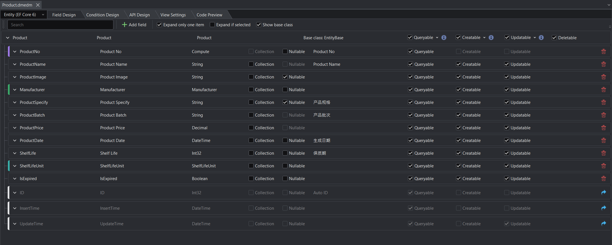

The following outlines the key steps to design the **Product** entity:

1. Set the **Product** entity to inherit from **EntityBase**.

   

   And the fields of the **EntityBase** entity will be shown as readonly underneath if the **Show base class** option is checked.

2. Set the **ProductNo** field to be a computed column, so that the product number will be generated based on the specified pattern, for example, P00001, P00002...

   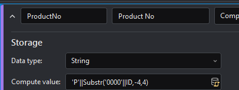

3. Set the **Manufacturer** field to reference to the **Manufacturer** entity.

   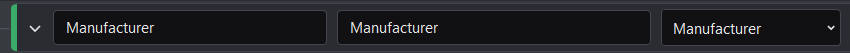

4. Set the "**Inverse navigation property**" option of the **Manufacturer** field to "**Products**" of the **Manufacturer** entity, because the **Product** entity has n-to-1 relationship with the **Manufacturer** entity.

   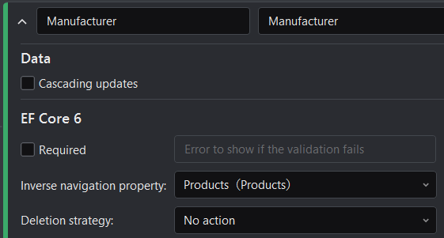

5. Set the **ShelfLifeUnit** field to reference to the **ShelfLifeUnit** enumerator, and set the default value to `ShelfLifeUnit.Day`.

   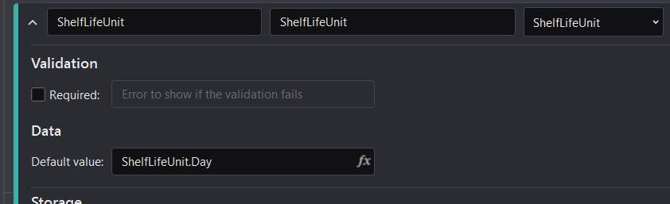

6. Set all the fields to be queryable, creatable, and updatable.

7. Select the **Condition Design** tab, and create a condition to filter data by the product expiration state and the production name or production specification.

   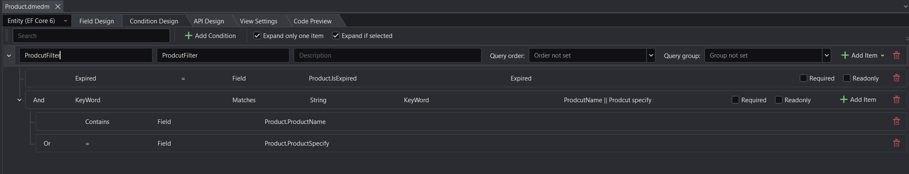

8. Check the settings in the **API Design** tab and the **View Settings** tab.

##### Manufacturer entity

The **Manufacturer** entity contains the fields as shown below.

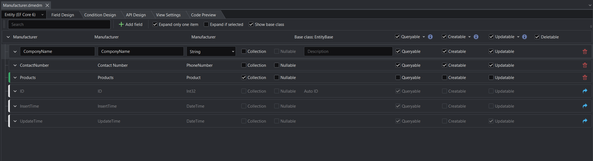

The following outlines the key steps to design the **Manufacturer** entity:

1. Set the **Manufacturer** entity to inherit from the **EntityBase**.

2. Set the **CompanyName** and **ContactNumber** fields to be queryable, creatable and updatable; which means you can view, create, and modify data values for these fields.

   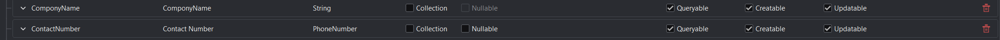

3. Set the **ContactNumber** field to the **PhoneNumber** type and validate the input values with the specified expression: 

   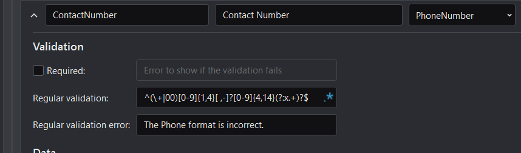

4. Set the **Products** field to reference to the **Product** entity; and set the field to not queryable, creatable, nor updatable, because it is not allowed to add products when creating a manufacturer. 

   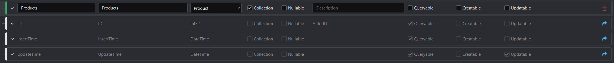

5. Check the settings in the **API Design** tab and the **View Settings** tab.

#### Design the OrderItem entity

Right-click the Sample.Design project and create a new "Entity design" item. In the sample application, you may open **OrderItem.dmedm** and see how it is designed.

The **OrderItem** entity contains the following fields:

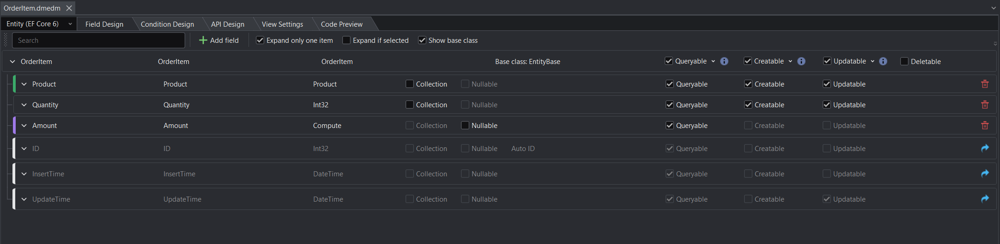

The following outlines the key steps to design the **OrderItem** entity:

1. Set the **OrderItem** entity to inherit from the **EntityBase**.

2. Set the **Product** field to reference to the **Product** entity. 

   The **OrderItem** entity has 1-to-1 relationship with the **Product** entity. 

   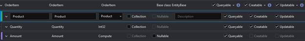

3. Set the **Amount** field to be a computed column. 

   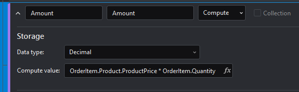

4. Check the settings in the **API Design** tab and the **View Settings** tab.

#### Design the Consumer and Order entities

Right-click the Sample.Design project and create two new "Entity design" items. These two entities will be designed at the same time, because they make references to/from each other.

In the sample application, you may open **Consumer.dmedm** and **Order.dmedm** and see how they are designed.

##### Order entity

The **Order** entity has the following fields:

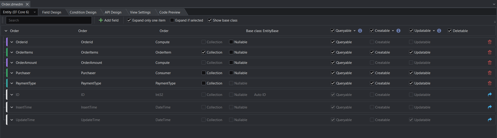

The following outlines the key steps to design the **Order** entity:

1. Set the **Order** entity to inherit from the **EntityBase**.

2. Set the **Orderid** field to be a compute field, so that the order ID is automatically generated based on the specified pattern.

   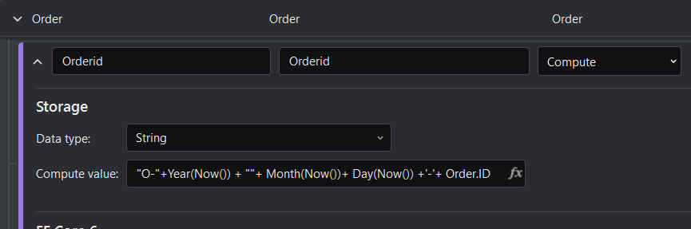

3. Set the **OrderItems** field to reference to the **OrderItem** entity.

4. Check the "**Cascading updates**" option for the **OrderItems** field, so that in the front-end UI, there can be master-detail view for the order items.

   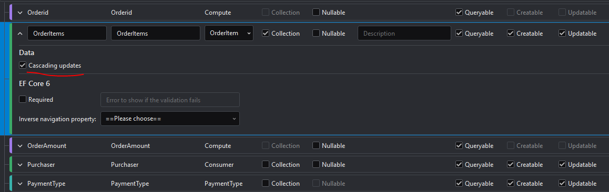

5. Set the **OrderAmount** field to be a computed column.

   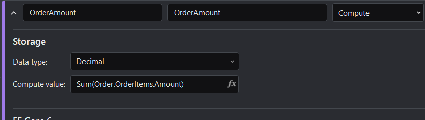

6. Set the **Purchaser** field to reference to the **Consumer** entity; and set the "**Inverse navigation property**" option of the **Purchaser** field to "**Orders**" of the **Consumer** entity, because the consumer may have multiple orders, therefore, the **Order** entity has n-to-1 relationship with the **Consumer** entity.

   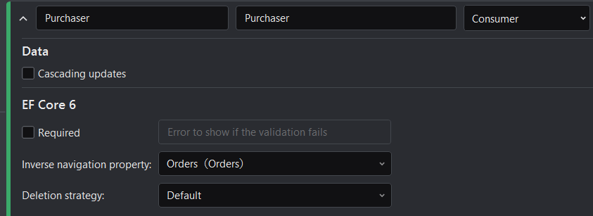

8. Set the **PaymentType** field to reference to the **PaymentType** enumerator and set its default value to an expression.

   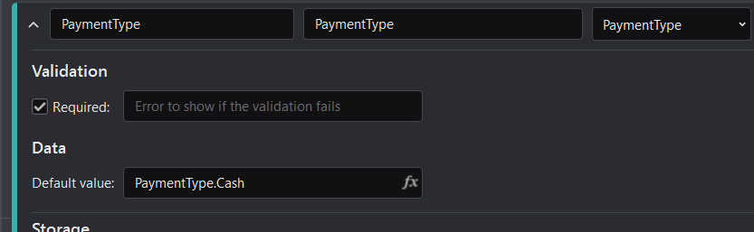

9. Select the **Condition Design** tab, and create a condition to filter data by the order payment type and the order insertion year.

   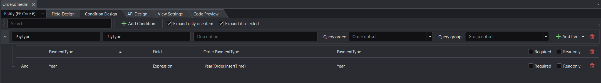

10. Check the settings in the **API Design** tab and the **View Settings** tab.

##### Consumer entity

The **Consumer** entity has the following fields:

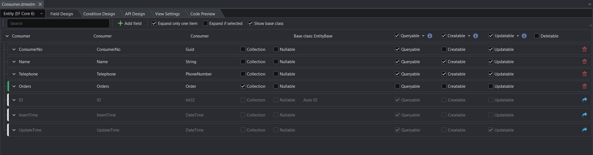

The following outlines the key steps to design the **Consumer** entity:

1. Set the **Consumer** entity to inherit from the **EntityBase**.

2. Set the **Orders** field to reference to the **Order** entity; set the field to be not queryable, creatable, nor updatable, as it is not allowed to create orders when creating a consumer; and set the **Deletion strategy** option for this field to **Cascade Delete**.

   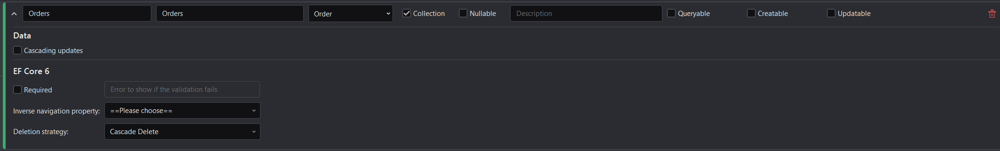

3. Select the **Condition Design** tab, and create a condition to filter data by the consumer name or the consumer phone number.

   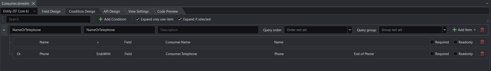

4. Check the settings in the **API Design** tab and the **View Settings** tab.

#### Design the model

The report reads data from existing entities, so in DevMagic Studio, the report is a model, not entity.

Right-click the Sample.Design project and create a new "Model design" item. In the sample application, you may open **OrderReport.dmmdl** and see how it is designed.

The **OrderReport** model has only one field:

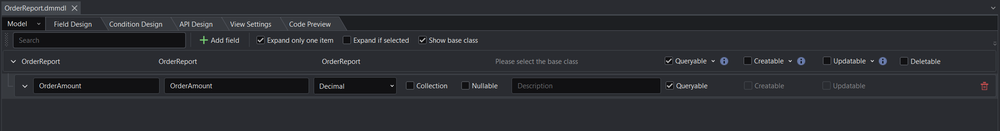

The following outlines the key steps to design the **OrderReport** model:

1. Set the **OrderAmount** field to the following expression, which means the report simply gets the order amount at a monthly basis. 

   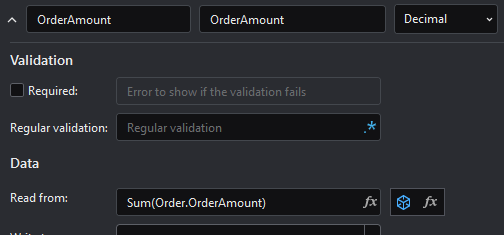

2. Select the **Condition Design** tab, and create a condition to filter the data by the year and month of the order insertion time.

   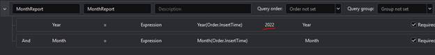

3. Check the settings in the **API Design** tab and the **View Settings** tab.

### Set initialization data

You can create a .cs file to set the initialization data. In the sample application, you may open the **Sample.EFCore** project > **DataSendInitilizer.cs** file and see how it is scripted.

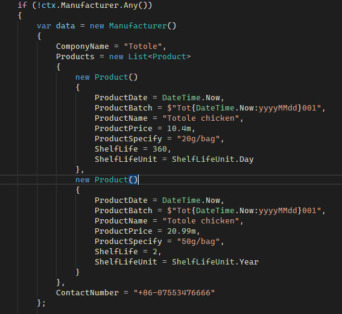

### Generate projects

Right click on the "**Sample.Design**" project node and then select **Generate Projects**.

### Run projects

After generating the projects, you can run the **Sample.WebApi** project to start the Web APIs first, and then run the **Sample.Client** project to start the application.

When the application is run, it allows you to perform the following operations:

- Add customers by specifying the customer name and phone number

  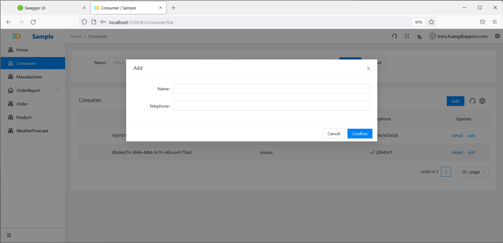

- Search customers by the customer name or phone number

  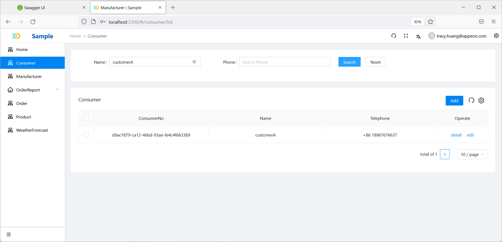

- Add new companies by specifying the company name and phone number

  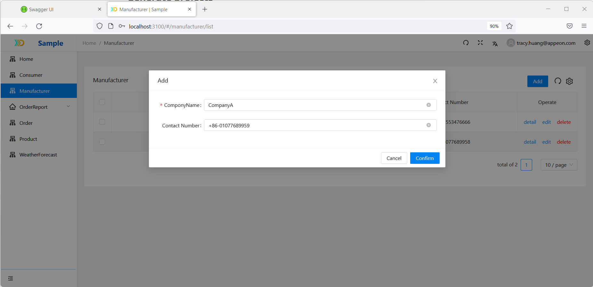

- Add new products (by specifying Product Name, Manufacturer, Product Specification, Product Batch, Product Price, Product Date, Shelf Life, ShelfLifeUnit)

  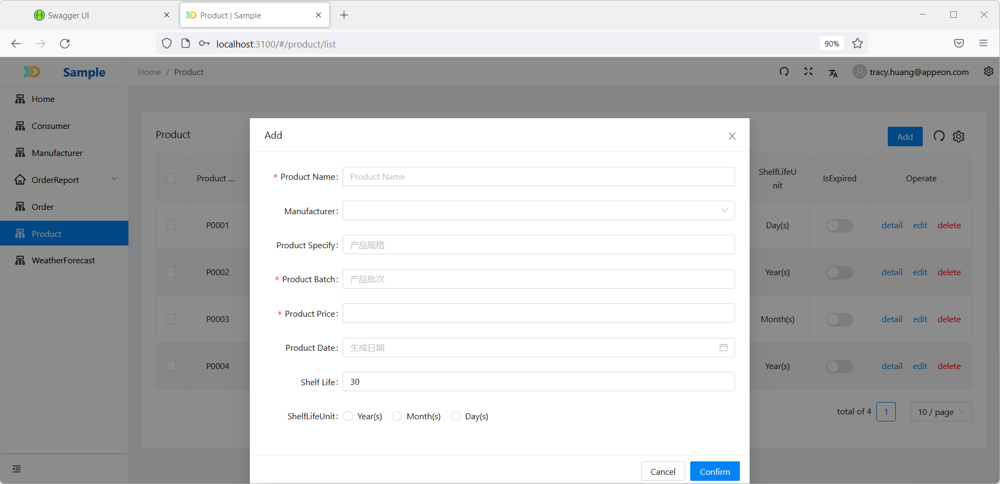

- Create orders.  Each order contains the following information: 

  - Purchaser

  - PaymentType

  - Order items (including product and quantity)

    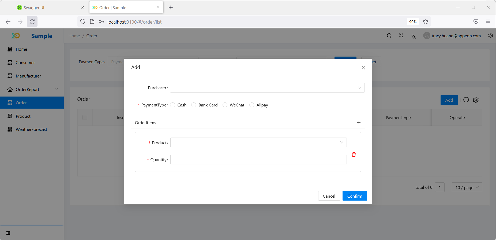

- Search for orders by the payment type or the year of placing the order.

  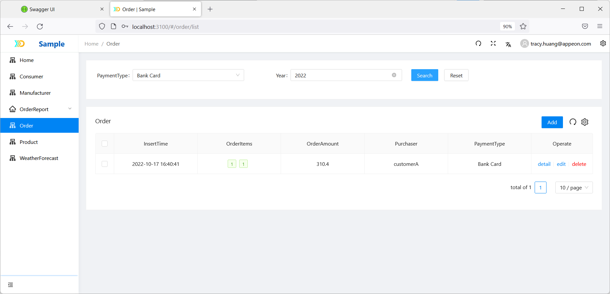

- Create statistics report based on the specified year and month. 

  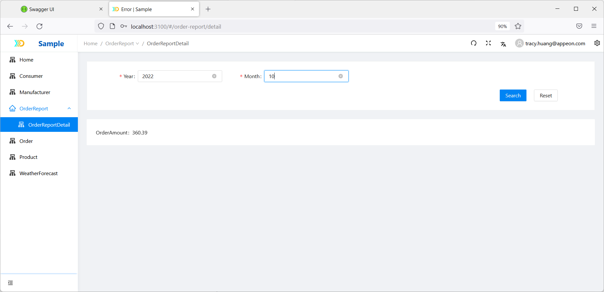

## 三，主要遇到问题

1，自关联、多个字段关联同一个模型（都存在代码问题），这个preview版本不会解决

2，设置了默认值以后，如果当前了可创建或可更新，默认值失效（如inserttime，前端不显示，又设置了created，这时候now的默认值无效，原因时默认值在实体中，没有在createmode中）

解决方案：默认新增的数据，不要勾选created

3，数据检索死循环（设计统计计算列时，部分表达式引用了计算列本身，选错了，当前没有任何表达式检测，如果列引用错误，很难调试）

4，前后端调试时，请求很快提示Task canceled，原因时前端模板默认10s超时，需要自己修改超时时间

5，前后端针对实体引用，都没有加入非空判断，如果对象为空，前后端都会异常，如直属上级（可以为空），暂时不用这种场景

6，业务模型调用自身字段的表达式（这个还不支持），暂时不提供这种场景

7，条件表达式莫名变化，不清楚什么原因

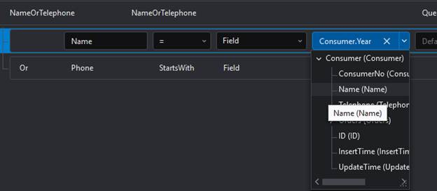

8，条件表达式，or逻辑错误（按姓名或电话查询时，如果不输入姓名，只输入电话无效，因为or关联了t=>true恒等式）

这个明天的版本验证，今天说已解决

9，前端代码的回退问题，导致主从表检索异常

10，复制模型文件到新的design下，基类、关联、表达式、sql计算列等都不会自动生成，需要重新设计预览

11，数据初始化失败，原因是sql计算列未正常生成（复制模型的问题，重新报错一遍计算列的sql）

12，业务模型中，生成的service没有include关联模型，导致数据统计出错（手工加入红色部分，可以从实体的service中复制）

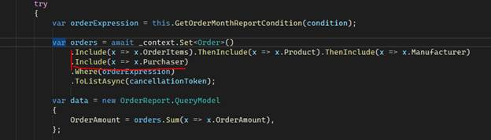

 
